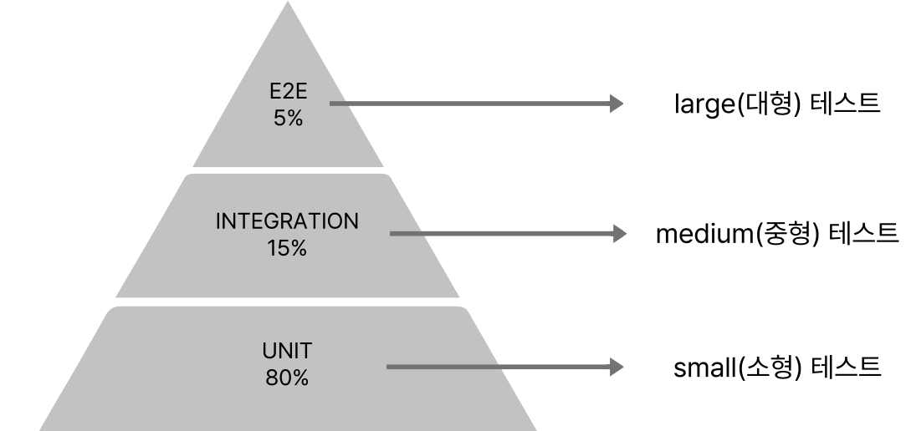

# 테스트

## 테스트란 무엇일까?

테스트는 크게 두 종류로 나눌 수 있다

- 인수 테스트
  - 사람이 직접 체크리스트를 확인하며 테스트는 하는 방법
- 자동 테스트
  - 테스트 코드를 돌려서 결과와 예상값을 비교하는 방법

## TDD

TDD는 Test Driven Development의 약자로 테스트 주도 개발이라고 하고 순서는 다음과 같다

1. 깨지는 테스트를 먼저 작성(RED)
2. 깨지는 테스트를 성공시킨다(GREEN)
3. 리팩토링을 한다(BLUE)

- 장점
  - 깨지는 테스트를 먼저 작성하기에, 인터페이스를 먼저 만드는 것이 강제된다.
    - 객체지향의 핵심 원리 중 하나인 행동에 집중
    - What/Who 사이클
      - 어떤 행위(What)를 할 것인지 먼저 정하고, 그 행위를 할 누가(Who)를 정한다.
      - 여기서 말하는 행위가 바로 메시지
  - 장기적인 관점에서 개발 비용 감소
    - 신규 개발이 있더라도 테스트코드가 있기에, feature 개발의 부담이 줄어듬
- 단점
  - 초기 개발비용이 증가
    - 테스트 코드를 작성하는데 시간이 들기 때문
  - 난이도
    - 구성원들의 숙련도가 뒷받침 되어야 함

## 개발자들의 고민

1. 무의미한 테스트
   - What/Who 사이클에서 말하는 행위는 모든 메서드를 말하는게 아님
   - 중요한 로직을 잘 구분해서 테스트를 구현하는 것이 좋음
   - 물론, 테스트 커버리지를 높이기 위해선 이런 테스트 모두 진행해야하지만, 중요한 로직을 먼저 테스트하는 것이 좋음
2. 느리고 쉽게 깨지는 테스트
   - 테스트가 느리면 개발자들이 테스트를 돌리기 꺼려짐
     - 어느날 코드를 돌려봤는데 변경이 없음에도 테스트가 실패하는 경우도 존재할 수 있음
     - 또는, 테스트간 병렬처리를 제대로 다루지 못해 테스트가 깨지는 경우도 존재
3. 테스트가 불가한 코드
   - 예를 들어 로그인한 시점에 대한 테스트

위와 같은 경우, 테스트가 신호를 보내고 있는 경우라고 보고 설계를 발전시킬 기회라고 판단해야한다.

---

## 테스트의 필요성

- 레거시 코드
  - 테스트가 없는 코드로 손대기가 어렵다
- Regression(회귀)
  - 잘 돌아가는 코드가 새로운 기능이나 변경으로 인해 영향을 끼쳐 다시 회귀하는 현상
  - 대부분 테스트가 필요하다고 생각하는 시점
  - `구글 엔지니어는 이렇게 일한다`에서 테스트가 없던 시절에는 릴리즈 주기도 길고 버그도 많았다
- 좋은 아키텍쳐 유도
  - 테스트는 SOLID 원칙을 지키도록 유도함

## 테스트의 3 분류

- 소형 테스트(단위 테스트)
  - 단일 서버, 단일 프로세스, 단일 스레드에서 돌아가는 테스트
  - Disk IO 나 Block Call이 존재해서도 안됨
  - 소형 테스트는 항상 결과가 결정적(Deterministic)이고 빠름
- 중형 테스트(통합 테스트)
  - 멀티 프로세스와 멀티 스레드를 사용하는 테스트
    - h2 같은 테스트 DB를 사용하는 경우
  - 소형 테스트 보다 느리고 비결정적(Non-Deterministic)
    - 즉 모듈에 따라 결과가 달라질 수 있음
- 대형 테스트(API 테스트)
  - 멀티 서버가 사용가능 하며 End-to-End(E2E) 테스트를 의미

우리가 집중해야하는 부분은 소형테스트이며 소형테스트를 늘릴 수 있는 환경을 만들고 이를 늘려야한다.

