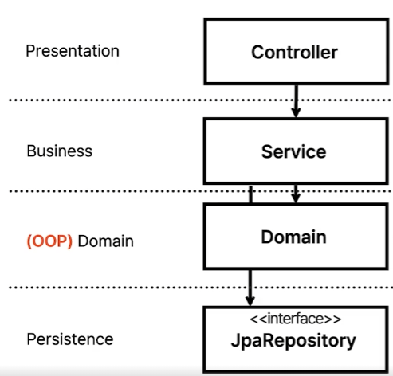
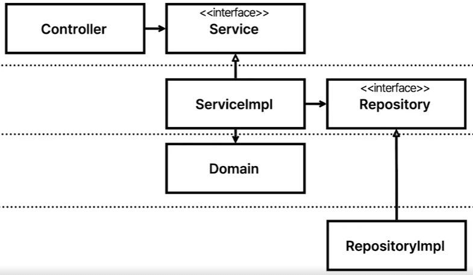

# 토이프로젝트 모듈의 문제

## 모든 테스트가 h2를 필요

- DB가 붙는 순간 중형테스트
- h2나 mockito 없이 테스트 불가능
- ElasticSearch 같은 Embeded DB는 테스트가 불가능

## 레이어드 아키텍쳐의 문제점

- 계층형 아키텍쳐는 `데이터베이스 주도 설계`를 유도
  - 모든것이 영속성 계층을 토대로 만들어진다
- 동시 작업 문제
  - 영속성 객체와 Repository가 나와야 Service 개발이 가능하고, Service를 개발해야 Controller 개발이 가능
  - 특정 기능을 한명만 개발할 수 밖에 없음
  - 레이어드 아키텍쳐 + 절차지향 코드의 문제점
- 도메인이 눈에 들어오지 않음
  - 서비스에서 모든 일을 다 처리하게 된다
결과적으로 절차지향적 사고를 유도하게 됨

### 레이어드 아키텍쳐의 해결책

> 도메인이란 비지니스 문제를 해결하는 객체

- Service에 집중되어 있던 비지니스 로직을 도메인으로 이동
  - Service는 단순히 Repository에서 도메인을 가져와서 도메인 계층에 일을 시키는 역할만 수행
- 도메인 영역에는 lombok을 제외한 어노테이션이 없는 오브젝트로 만든다
  - `도메인 엔티티와 영속성 객체를 구분`
- 도메인 계층은 계층을 넘나드는 의존이 없기에 계층간 의존성을 위한 mocking이 필요없음

최종적인 아키텍쳐

